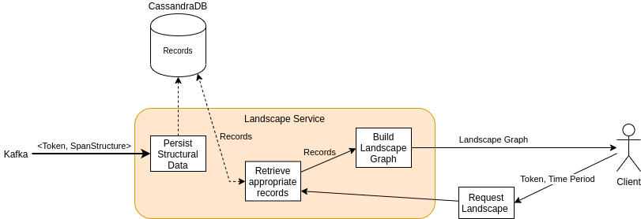

[](https://git.se.informatik.uni-kiel.de/ExplorViz/code/landscape-service/-/commits/master) 

[](https://git.se.informatik.uni-kiel.de/ExplorViz/code/landscape-service/-/commits/master)


# ExplorViz Landscape-Service

Service that processes and provides structural data of monitored landscapes.

## Features



The service serves two purposes

1. passively processing and persisting structural information, and
2. assembling and delivering structural information of the observed landscape(s) to the clients.

### Processing Structural Information

The service consumes `SpanStructure` records from a Kafka topic. 
These records consist of the parts of spans that contain information relating to structural/topological information of monitored applications:

- Host name and address
- Application name and language
- Identification of specific instances of the same application
- Package structures
- Classes and methods

Structural information are in contrast to dynamical information describing call-relationships between entities.
Each record is transformed into an internal data structure ([LandscapeRecord](src/main/avro/landscaperecord.avsc)) and persisted into a Cassandra database for further access.

### Providing Landscape Graphs

Upon client requests, the service gathers all relevant records from the database and assembles a graph structure out of them.
This graph is delivered to the requesting client.

## The Landscape Graph

The representation of the structure/topology of a monitored landscape is delivered to the user as a directed graph, the *landscape graph*.
The landscape graph is defined as an [avro schema](src/main/avro/landscape.avsc) and has the following structure.


Each landscape is uniquely identified by its token which is issued to the user prior to monitoring and thus forms the root of the graph.
On requests, the user has to specify at least the token to retrieve the corresponding graph. 
The graph is then assembled on the fly.
On the topmost level, the landscape consists of one to many hosts, each of which running multiple applications.
Applications contain their respective package structure and classes. 
The leaves of the graph are the methods. 
Each leaf is marked with a fingerprint, that uniquely identifies it.
These fingerprints are needed to map traces, which are retrieved separately, onto the corresponding methods unambiguously.


## Instructions

Run the ExplorViz software stack, see [ExplorViz/deployment](https://git.se.informatik.uni-kiel.de/ExplorViz/code/deployment).

### Running the application in dev mode

You can run your application in dev mode that enables live coding using:
```
./gradlew quarkusDev
```

### Packaging and running the application

The application can be packaged using `./gradlew quarkusBuild`.
It produces the `landscape-service-1.0.0-SNAPSHOT-runner.jar` file in the `build` directory.
Be aware that it’s not an _über-jar_ as the dependencies are copied into the `build/lib` directory.

The application is now runnable using `java -jar build/landscape-service-1.0.0-SNAPSHOT-runner.jar`.

If you want to build an _über-jar_, just add the `--uber-jar` option to the command line:
```
./gradlew quarkusBuild --uber-jar
```

### Creating a native executable

You can create a native executable using: `./gradlew build -Dquarkus.package.type=native`.

Or, if you don't have GraalVM installed, you can run the native executable build in a container using: `./gradlew build -Dquarkus.package.type=native -Dquarkus.native.container-build=true`.

You can then execute your native executable with: `./build/landscape-service-1.0.0-SNAPSHOT-runner`

If you want to learn more about building native executables, please consult https://quarkus.io/guides/gradle-tooling#building-a-native-executable.
