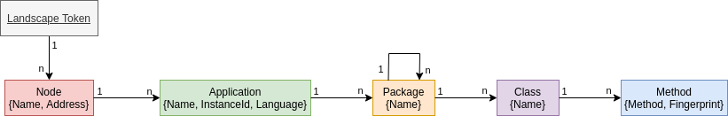

[](https://git.se.informatik.uni-kiel.de/ExplorViz/code/landscape-service/-/commits/master) 

[](https://git.se.informatik.uni-kiel.de/ExplorViz/code/landscape-service/-/commits/master)


# ExplorViz Landscape-Service

Service that processes and provides structural data of monitored landscapes.

## Features


The service serves two purposes

1. passively processing and persisting structural information, and
2. assembling and delivering structural information of the observed landscape(s) to the clients.

### Processing Structural Information

The service consumes `SpanStructure` records from a Kafka topic. 
These records consist of the parts of spans that contain information relating to structural/topological information of monitored applications:

- Host name and address
- Application name and language
- Identification of specific instances of the same application
- Package structures
- Classes and methods

Structural information are in contrast to dynamical information describing call-relationships between entities.
Each record is transformed into an internal data structure ([LandscapeRecord](src/main/avro/landscaperecord.avsc)) and persisted into a Cassandra database for further access.

### Providing Landscape Graphs

The representation of the structure/topology of a monitored landscape is delivered to the user as a directed graph, the *landscape graph*.
Upon client requests, the service gathers all relevant records from the database and assembles the graph.
It is delivered to the requesting client in json format. 
For example, the following is the landscape graph for the [fibonacci example application](https://git.se.informatik.uni-kiel.de/ExplorViz/code/deployment/-/tree/master/example-applications/fibonacci).

<details>
<summary>Fibonacci Landscape JSON</summary>

```json
{
  "landscapeToken" : "fibonacci-landscape",
  "nodes" : [ {
    "ipAddress" : "192.168.178.1",
    "hostName" : "host",
    "applications" : [ {
      "name" : "fibonacci",
      "language" : "java",
      "instanceId" : "1",
      "packages" : [ {
        "name" : "net",
        "subPackages" : [ {
          "name" : "explorviz",
          "subPackages" : [ {
            "name" : "sampleApplication",
            "subPackages" : [ {
              "name" : "application",
              "subPackages" : [ {
                "name" : "math",
                "subPackages" : [ ],
                "classes" : [ {
                  "name" : "Fibonacci",
                  "methods" : [ {
                    "name" : "calculate",
                    "hashCode" : "0b064d846e37337db07991f806a36f4fcacab5517d2801918ba6ba65284c9888"
                  } ]
                } ]
              } ],
              "classes" : [ {
                "name" : "JavaExample",
                "methods" : [ {
                  "name" : "start",
                  "hashCode" : "05dc4a2405adf51e81214c7a8a237ad68bd329939296729619b3c50eb878c114"
                } ]
              } ]
            }, {
              "name" : "database",
              "subPackages" : [ {
                "name" : "helper",
                "subPackages" : [ ],
                "classes" : [ {
                  "name" : "SQLStatementHandler",
                  "methods" : [ {
                    "name" : "executeStatementHandler",
                    "hashCode" : "4a16407ec3a7f718dcbf29804d0f3e77307760bea7b559c0d29a2a34146e0841"
                  } ]
                }, {
                  "name" : "SQLConnectionHandler",
                  "methods" : [ {
                    "name" : "createDatabase",
                    "hashCode" : "add6b7c9487e285cb08bd11208dec851f1e73b6e4a337835b333f29a9b59c407"
                  }, {
                    "name" : "disconnect",
                    "hashCode" : "ce8f8b85e0fb0629658df0418c050521ee7ea66ee3552b1dd7d0860f90fe8117"
                  }, {
                    "name" : "connect",
                    "hashCode" : "f6576f4c545ee315e49c65605dcc851f96bf49e80845ce0ce3c958b45a87557e"
                  } ]
                } ]
              } ],
              "classes" : [ {
                "name" : "JDBCExample",
                "methods" : [ {
                  "name" : "start",
                  "hashCode" : "70bb60fab08e07532ce6e79de333541bc498a7f448c99d934685603d2f06ed8b"
                }, {
                  "name" : "runQueries",
                  "hashCode" : "c5fc10c742e58f3e344816a079e65b2c2c49b28a36659a7a0c20070a66210656"
                } ]
              } ]
            }, {
              "name" : "util",
              "subPackages" : [ ],
              "classes" : [ {
                "name" : "RandomNumberGenerator",
                "methods" : [ {
                  "name" : "getRandomNumber",
                  "hashCode" : "c66b6f4c8acbfa4a65837d721344387bcb7ad2ffa2f733ff44370abccb599c66"
                } ]
              } ]
            } ],
            "classes" : [ {
              "name" : "Main$DatabaseTask",
              "methods" : [ {
                "name" : "run",
                "hashCode" : "4b4c314927bd5061592c8c5a6a194a054216f8fa4e0324f5304ea1179bae2776"
              } ]
            }, {
              "name" : "Main$ApplicationTask",
              "methods" : [ {
                "name" : "run",
                "hashCode" : "97aca15b161345d9f5de793fbde8192a8b16b47138e9dc18d3b76a8b3c7b13d7"
              } ]
            } ]
          } ],
          "classes" : [ ]
        } ],
        "classes" : [ ]
      } ]
    } ]
  } ]
}
```
</details>

It corresponds to the following landscape graph.


The structure of landscape graphs is defined as follows:



The landscape token, which uniquely identifies the landscape, is the root of the tree.
On requests, the user has to specify at least the token to retrieve the corresponding graph. 
On the topmost level, the landscape consists of one to many hosts, each of which running multiple applications.
Applications contain their respective package structure and classes. 
The leaves of the graph are the methods. 
Each leaf is marked with a fingerprint, that uniquely identifies it.
These fingerprints are needed to map traces, which are retrieved separately, onto the corresponding methods unambiguously.

See the [avro schema](src/main/avro/landscape.avsc) for further details.


## Instructions

Run the ExplorViz software stack, see [ExplorViz/deployment](https://git.se.informatik.uni-kiel.de/ExplorViz/code/deployment).

### Running the application in dev mode

You can run your application in dev mode that enables live coding using:
```
./gradlew quarkusDev
```

### Packaging and running the application

The application can be packaged using `./gradlew quarkusBuild`.
It produces the `landscape-service-1.0.0-SNAPSHOT-runner.jar` file in the `build` directory.
Be aware that it’s not an _über-jar_ as the dependencies are copied into the `build/lib` directory.

The application is now runnable using `java -jar build/landscape-service-1.0.0-SNAPSHOT-runner.jar`.

If you want to build an _über-jar_, just add the `--uber-jar` option to the command line:
```
./gradlew quarkusBuild --uber-jar
```

### Creating a native executable

You can create a native executable using: `./gradlew build -Dquarkus.package.type=native`.

Or, if you don't have GraalVM installed, you can run the native executable build in a container using: `./gradlew build -Dquarkus.package.type=native -Dquarkus.native.container-build=true`.

You can then execute your native executable with: `./build/landscape-service-1.0.0-SNAPSHOT-runner`

If you want to learn more about building native executables, please consult https://quarkus.io/guides/gradle-tooling#building-a-native-executable.
